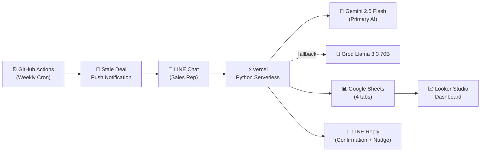
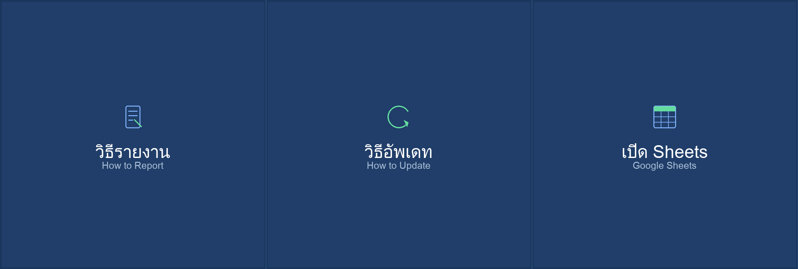

# ATE Sales Report System

AI-powered sales reporting for Thai B2B field teams — LINE chat in, structured data out, live dashboard updated.

A production sales reporting system built for [ATE (Advanced Technology Equipment Co., Ltd.)](https://www.ate.co.th), a Thai B2B distributor of industrial equipment (Megger, Fluke, CRC, Salisbury, SmartWasher, IK Sprayer, HVOP). Field sales reps send natural Thai text in LINE chat; Gemini AI parses it into structured data across 24 columns; data writes to Google Sheets across 4 tabs; a Looker Studio dashboard updates automatically. Every component runs on free tiers — total recurring cost: **$0/month**.

---

## Architecture



> LINE message → Vercel Python → Gemini AI parse → Google Sheets (4 tabs) → LINE confirmation reply → Looker Studio dashboard

See [`ARCHITECTURE.md`](ARCHITECTURE.md) for the full 15-section architecture document.

---

## How It Works

**Sales rep sends a Thai message in LINE:**
```
ไปเยี่ยม PTT คุณวีระ 081-234-5678 เสนอ Megger MTO330 ราคา 150,000 สถานะเจรจา
```

**Bot replies with structured confirmation:**
```
รับทราบครับ บันทึกแล้ว:
- เข้าพบลูกค้า: PTT
- ผู้ติดต่อ: คุณวีระ (081-234-5678)
- สินค้า: Megger MTO330
- มูลค่า: ฿150,000
- สถานะ: เจรจา
📋 Batch ID: MSG-A1B2C
```

The data is simultaneously written to 4 Google Sheets tabs and the dashboard updates in real time.

<details>
<summary>Parsed JSON structure (what gets written to Sheets)</summary>

```json
{
  "is_sales_report": true,
  "activities": [{
    "customer_name": "PTT",
    "contact_person": "คุณวีระ",
    "contact_channel": "081-234-5678",
    "product_brand": "Megger",
    "product_name": "MTO330",
    "deal_value_thb": 150000,
    "activity_type": "visit",
    "sales_stage": "negotiation",
    "batch_id": "MSG-A1B2C"
  }]
}
```
</details>

### Other Interactions

| Command | What It Does |
|---------|-------------|
| `อัพเดท MSG-A1B2C สถานะปิดได้ วางมัดจำ 50%` | Update existing deal — AI parses only changed fields |
| `สรุป` | AI-generated Thai pipeline summary with stats |
| Weekly push (automatic) | Stale deal reminders for deals with no update in 7+ days |

---

## Features

| | Feature | Description |
|---|---------|-------------|
| 🤖 | **Thai NLP Parsing** | Mixed Thai/English, Thai currency slang (แสนห้า, 1.5ล้าน), Thai dates (อังคารหน้า) |
| 🤖 | **Dual AI Failover** | Gemini 2.5 Flash primary, Groq Llama 3.3 70B automatic fallback |
| 🤖 | **Few-Shot Prompting** | 8 curated examples covering visits, closures, losses, service, bidding |
| 📊 | **24-Column Schema** | Full activity lifecycle from lead to close, including training and close reasons |
| 📊 | **Multi-Sheet Write** | Every report → Rep Personal + Combined + Live Data + Major Opportunity (Megger) |
| 📊 | **Smart Match** | Detects existing active deals with same customer+brand, suggests batch IDs |
| 📊 | **Update System** | Modify existing deals via `อัพเดท MSG-XXXXX` — AI parses only changes |
| 💬 | **Hard Validation** | Reports without phone/email are rejected before saving |
| 💬 | **3-Tier Nudge** | Polite Thai hints for missing fields (0=none, 1-2=hint, 3+=hint+example) |
| 💬 | **Rich Menu** | 3-button LINE interface (How to Report, How to Update, Open Sheets) |
| ⚙️ | **Stale Deal Cron** | GitHub Actions weekly push — reps notified of 7+ day old deals |
| ⚙️ | **Zero SDK Design** | Only 2 pip dependencies (gspread, google-auth); all APIs via urllib |

---

## Tech Stack

| Layer | Technology | Role | Cost |
|-------|-----------|------|------|
| Chat Interface | LINE Messaging API | Sales rep input + bot replies | Free |
| Serverless Runtime | Vercel Python | Webhook handler + API endpoints | Free (Hobby) |
| Primary AI | Google Gemini 2.5 Flash | Thai NLP → structured JSON | Free tier |
| Fallback AI | Groq Llama 3.3 70B | Automatic failover | Free tier |
| Database | Google Sheets (gspread) | Multi-tab structured storage | Free |
| Dashboard | Looker Studio | KPIs, pipeline, brand mix | Free |
| Cron | GitHub Actions | Weekly stale deal check | Free |

> **Total recurring cost: $0/month**

---

## Rich Menu



3-button persistent menu in LINE with bilingual Thai/English labels:
- **วิธีรายงาน** (How to Report) — shows reporting guide with examples
- **วิธีอัพเดท** (How to Update) — shows update command syntax
- **เปิด Sheets** (Google Sheets) — opens the spreadsheet directly

---

## Key Design Decisions

| Decision | Approach | Rationale |
|----------|----------|-----------|
| **HTTP client** | `urllib.request` for LINE, Gemini, Groq — no SDKs | Eliminates version conflicts on Vercel's Python runtime; only 2 pip deps total |
| **Database** | Google Sheets via gspread | Free, familiar to sales managers, sufficient for 6-8 reps; would migrate to PostgreSQL at scale |
| **AI failover** | Gemini primary, Groq secondary | Gemini has superior Thai parsing; Groq provides sub-second fallback if Gemini is down |
| **Lazy imports** | gspread/google-auth imported inside functions | Vercel's Python runtime fails on module-level imports of these libraries |
| **Multi-tab writes** | Every report → 4 sheets | Serves different audiences (rep self-view, manager combined, permanent audit, high-value Megger tracking) without complex queries |

---

## Project Structure

```
ate_sales_report_system_planning/
├── README.md                        ← You are here
├── ARCHITECTURE.md                  # Full 15-section system architecture
├── vercel.json                      # Build config (points to demo/api/)
├── requirements.txt                 # gspread + google-auth
├── .github/
│   └── workflows/
│       └── stale-check.yml          # Weekly cron trigger
├── demo/
│   ├── api/
│   │   ├── webhook.py               # Main serverless function (1,260 lines)
│   │   └── stale_check.py           # Stale deal endpoint (264 lines)
│   ├── populate_sample_data.py      # Sample data + sheet formatting
│   ├── generate_rich_menu_image.py  # Rich menu PNG generator
│   ├── setup_rich_menu.py           # Rich menu LINE API setup
│   ├── requirements.txt             # Python dependencies
│   └── README.md                    # Detailed deployment guide
└── docs/                            # Setup guides & planning docs
    └── archive/                     # Superseded docs
```

---

## Getting Started

### Prerequisites

- Python 3.9+
- [Vercel](https://vercel.com) account (free Hobby plan)
- [LINE Developer](https://developers.line.biz) account (free)
- Google Cloud project with Sheets API enabled
- [Gemini API key](https://aistudio.google.com/apikey) (free)
- [Groq API key](https://console.groq.com) (optional, for fallback)

### Environment Variables

| Variable | Purpose |
|----------|---------|
| `LINE_CHANNEL_SECRET` | Webhook signature validation |
| `LINE_CHANNEL_ACCESS_TOKEN` | LINE API authentication |
| `GEMINI_API_KEY` | Gemini AI API key |
| `GROQ_API_KEY` | Groq fallback API key (optional) |
| `GOOGLE_SHEETS_ID` | Target spreadsheet ID |
| `GOOGLE_SERVICE_ACCOUNT_JSON` | Service account credentials (full JSON) |
| `CRON_SECRET` | Stale check endpoint auth |

### Quick Start

```bash
# 1. Clone
git clone https://github.com/Pann13223029/ate-sales-report-demo.git
cd ate-sales-report-demo

# 2. Set environment variables on Vercel
vercel env add LINE_CHANNEL_SECRET
vercel env add LINE_CHANNEL_ACCESS_TOKEN
vercel env add GEMINI_API_KEY
vercel env add GOOGLE_SHEETS_ID
vercel env add GOOGLE_SERVICE_ACCOUNT_JSON

# 3. Deploy
vercel --prod

# 4. Verify
curl https://your-project.vercel.app/api/webhook
# → {"status": "ok", "service": "ATE Sales Report Bot", ...}

# 5. Set LINE webhook URL to: https://your-project.vercel.app/api/webhook
```

For detailed step-by-step setup (API keys, Google Sheets, LINE, Looker Studio), see [`demo/README.md`](demo/README.md).

---

<details>
<summary><strong>Data Model (24 columns, A–X)</strong></summary>

```
A: Timestamp           I: Deal Value (THB)    Q: Close Reason
B: Rep Name            J: Activity Type       R: Follow-up Notes
C: Customer            K: Sales Stage         S: Summary (EN)
D: Contact Person      L: Payment Status      T: Raw Message
E: Contact Channel     M: Planned Visit Date  U: Batch ID
F: Product Brand       N: Bidding Date        V: Item #
G: Product Name        O: Accompanying Rep    W: Source (live/sample)
H: Quantity            P: Training Flag       X: Manager Notes
```

**Key enums:** 8 activity types · 10 sales stages · 7 product brands

See [ARCHITECTURE.md § Data Model](ARCHITECTURE.md#4-data-model) for full schema with types and enums.

</details>

---

## Documentation

| Document | Contents |
|----------|----------|
| [`ARCHITECTURE.md`](ARCHITECTURE.md) | Full system architecture — data model, AI pipeline, validation, error handling |
| [`demo/README.md`](demo/README.md) | Detailed deployment guide with step-by-step setup |
| [`docs/01_LINE_Setup_Guide.md`](docs/01_LINE_Setup_Guide.md) | LINE Developer Console setup |
| [`docs/03_Google_Sheets_Template.md`](docs/03_Google_Sheets_Template.md) | Sheets template and column reference |
| [`docs/10_Cron_Setup_Guide.md`](docs/10_Cron_Setup_Guide.md) | Stale deal cron configuration |
| [`docs/08_Roadmap.md`](docs/08_Roadmap.md) | Feature roadmap and decision log |

---

## Roadmap

- Photo/receipt OCR via Gemini Vision
- Monthly auto-summary cron push to management
- Competitor tracking from lost-deal close reasons
- Pipeline revenue forecasting

See [`docs/08_Roadmap.md`](docs/08_Roadmap.md) for the full roadmap.

---

Built for **ATE (Advanced Technology Equipment Co., Ltd.)**
