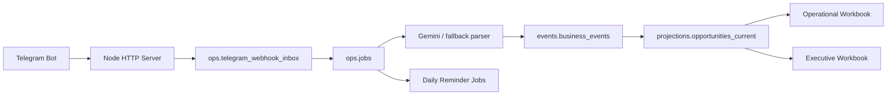

# ATE Sales Report System

This repository now contains **two different system tracks**:

- `current path`: a `Telegram + Postgres + Google Sheets + TypeScript` rebuild under [src](/Users/openclaw/ate-sales-report-demo/src) and [db](/Users/openclaw/ate-sales-report-demo/db)
- `legacy path`: the older `LINE + Python + Google Sheets` demo under [demo](/Users/openclaw/ate-sales-report-demo/demo)

The current engineering work is happening on the **Telegram/Postgres rebuild**. The legacy demo is retained for reference only.

## Repo Status

The new stack already includes:

- SQL-first Postgres schema and migrations
- typed Kysely/Neon data layer
- durable Telegram webhook inbox and async job queue
- Gemini-first parsing with heuristic fallback
- draft, confirm, create, update, and `/mydeals` flows
- daily stale reminders at `08:30 Asia/Bangkok`
- operational and executive Google workbook export jobs
- operational sheet sync-back and incident surfacing
- core tests and typecheck coverage

What is **not** fully done yet:

- live environment bring-up in this workspace
- final deployment packaging for production hosting
- full repo-wide migration of every old `demo/` asset into the new stack

## Current Architecture



Main contract:

- `events.business_events` is the append-only business history
- `projections.opportunities_current` is the authoritative current-state read model
- workbook sync, reminders, Telegram send, and sheet reconciliation run through `ops.jobs`

## Repo Layout

```text
ate-sales-report-demo/
├── src/                    # Current TypeScript application
├── db/                     # Current SQL-first schema and migrations
├── docs/08_Telegram_Postgres_Runbook.md
├── demo/                   # Legacy LINE/Python demo
├── ARCHITECTURE.md         # Legacy architecture doc with warning banner
├── package.json            # Current Node scripts
├── .env.example            # Current env template
├── requirements.txt        # Legacy Python demo deps
└── vercel.json             # Legacy Vercel routing for demo/api/*
```

Important note:

- [vercel.json](/Users/openclaw/ate-sales-report-demo/vercel.json) still points to the legacy Python demo.
- The new TypeScript server is started with `npm run serve`; it is not yet wired to the old Vercel config.

## Quick Start

Prerequisites:

- `Node.js >= 20`
- PostgreSQL / Neon database
- Telegram bot token
- optional Gemini API key
- optional Google service account + workbook IDs

Setup:

```bash
npm install
cp .env.example .env
npm run db:migrate
npm run typecheck
npm test
npm run serve
```

The local server exposes:

- `GET /healthz`
- `POST /telegram/webhook`

The same runtime also:

- drains async jobs
- runs the reminder scheduler
- can enqueue operational sheet reconciliation jobs

## Key Scripts

```bash
npm run db:migrate
npm run serve
npm run telegram:webhook info
npm run telegram:webhook set https://your-public-host
npm run worker:drain-jobs
npm run worker:run-scheduler
npm run worker:enqueue-daily-reminders
npm run typecheck
npm test
```

## Environment

See [.env.example](/Users/openclaw/ate-sales-report-demo/.env.example) for the full template.

Core:

- `DATABASE_URL`
- `PORT`
- `JOB_POLL_INTERVAL_MS`

Telegram:

- `TELEGRAM_BOT_TOKEN`
- `TELEGRAM_WEBHOOK_SECRET`
- `PUBLIC_WEBHOOK_URL`

Gemini:

- `GEMINI_API_KEY`
- `GEMINI_MODEL`

Google workbooks:

- `GOOGLE_SERVICE_ACCOUNT_JSON`
- `OPERATIONAL_WORKBOOK_ID`
- `EXECUTIVE_WORKBOOK_ID`
- `SHEET_SYNC_ACTOR_USER_ID`
- `SHEET_SYNC_INTERVAL_MINUTES`

Reminders:

- `REMINDER_TIMEZONE`
- `REMINDER_DAILY_HOUR`
- `REMINDER_DAILY_MINUTE`

## Docs

Current:

- [db/README.md](/Users/openclaw/ate-sales-report-demo/db/README.md) — SQL schema foundation
- [docs/08_Telegram_Postgres_Runbook.md](/Users/openclaw/ate-sales-report-demo/docs/08_Telegram_Postgres_Runbook.md) — current bring-up and operations runbook

Legacy:

- [demo/README.md](/Users/openclaw/ate-sales-report-demo/demo/README.md) — old LINE/Python demo
- [ARCHITECTURE.md](/Users/openclaw/ate-sales-report-demo/ARCHITECTURE.md) — old demo architecture
- [docs/01_LINE_Setup_Guide.md](/Users/openclaw/ate-sales-report-demo/docs/01_LINE_Setup_Guide.md) through [docs/07_PDPA_Compliance_Package.md](/Users/openclaw/ate-sales-report-demo/docs/07_PDPA_Compliance_Package.md) — mostly demo-era documentation

## Recommended Next Step

The repo is now clear enough to operate the new path. The next practical step is:

1. set real env vars
2. run `npm run db:migrate`
3. run `npm run serve`
4. register the Telegram webhook
5. exercise one create flow, one update flow, one reminder flow, and one manager sheet correction end to end
